Author: Besoiobiy, on the Patternflow Discord (https://discord.gg/Vr9QtsxeTk)  
License: CC-BY-SA-4.0  
Based on: original design  
Fits: v3 board (v3.9 and v3.0 share the outline) and a 320 × 160 mm, 128 × 64 LED panel with M3 mounting sockets and a socket depth of 14.35 mm, like Besoiobiy's; [check your panel first](#check-your-panel-first)  
Material: PLA, set up for a Bambu Lab P1S with a 0.4 mm nozzle; white case, black knob caps. The print settings are in [`print_layout.3mf`](print_layout.3mf)  
Verified: 2026-10-08, photo below. Built by its author, and working for a week when they shared it

# Besoiobiy's printed case

A printed case in two long pieces glued side by side: a frame around the LED panel, and a box beside it for the board and the battery, with the PATTERNFLOW lettering down its outer side. Each piece is split in two across its length so that every part fits a 256 mm bed. Four flat covers close the back with countersunk screws. The panel is not held by the frame alone: twelve M3 × 25 bolts go through the frame's covers and its tabs into the panel's own threaded sockets, clamping the three together. The knobs are new caps that go straight onto the encoder shafts. Assembled, it is about 267 × 329 × 31 mm.

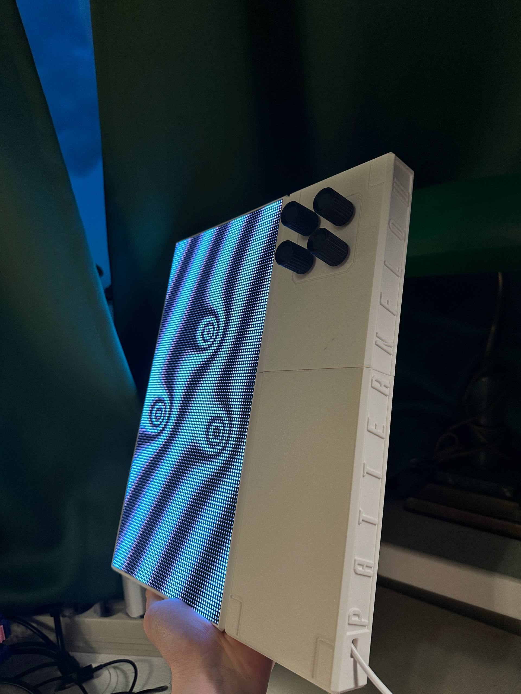 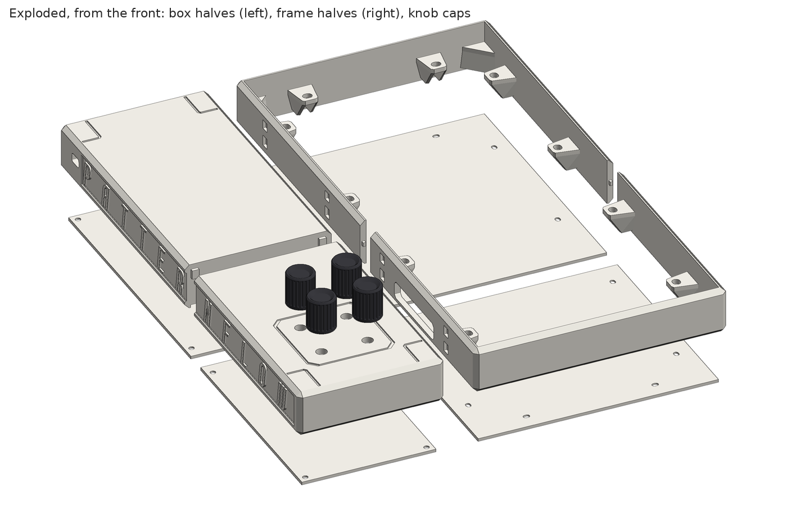

*Left: Besoiobiy's build, held upright with the knobs at the top. Right: the same parts pulled apart, rendered from the STL files.*

In this folder, **top** means the end with the knobs and **bottom** the other end, as the case is held in the photo. The top half of the box holds the board; the bottom half is the battery bay (Besoiobiy's files call it the battery case).

This folder replaces the printing and case-assembly sections of the [build guide](../../../../BUILD_GUIDE.md) (4 and 6), and changes the order of the wiring in section 7: the panel has to be wired before its covers go on. The electronics, the soldering and the firmware are the same.

## Files

| File | What |
| :--- | :--- |
| [`stl/`](stl/) | One STL per part, 13 files, each already lying the way it prints. [The parts](#the-parts) lists them. |
| [`print_layout.3mf`](print_layout.3mf) | Besoiobiy's Bambu Studio project (sent as `Pattern.3mf`): nine parts side by side in their print orientation, with the print settings. Read [The 3MF](#the-3mf) before printing from it. |
| [`source/patternbox.blend`](source/patternbox.blend) | The Blender scene (sent as `PatternBox.blend`), saved with Blender 5.2. Its header asks for Blender 4.5 or newer; 5.0 and 5.1 open it with a warning that it comes from a newer version. |
| [`source/patternbox.stl`](source/patternbox.stl) | The STL as Besoiobiy exported it (sent as `PatternBox.stl`): the whole model in one file, the way they left it. The parts face the way they do when assembled but are pulled apart, with the variant box halves stacked above the main ones, the covers behind, and modelling helpers far off. It is not for printing; `stl/` is cut from it. |
| [`images/`](images/) | Besoiobiy's eight figures, named `fig1_…` to `fig8_…` after the figure numbers in their notes, the photo, and renders of the STL files. |

The `.blend` is stored in Git LFS, like the official case's source: GitHub's *Download ZIP* gives a 131-byte pointer instead of the 655 KB scene. Clone with Git LFS installed, or open the file on GitHub and download it from there.

## The parts

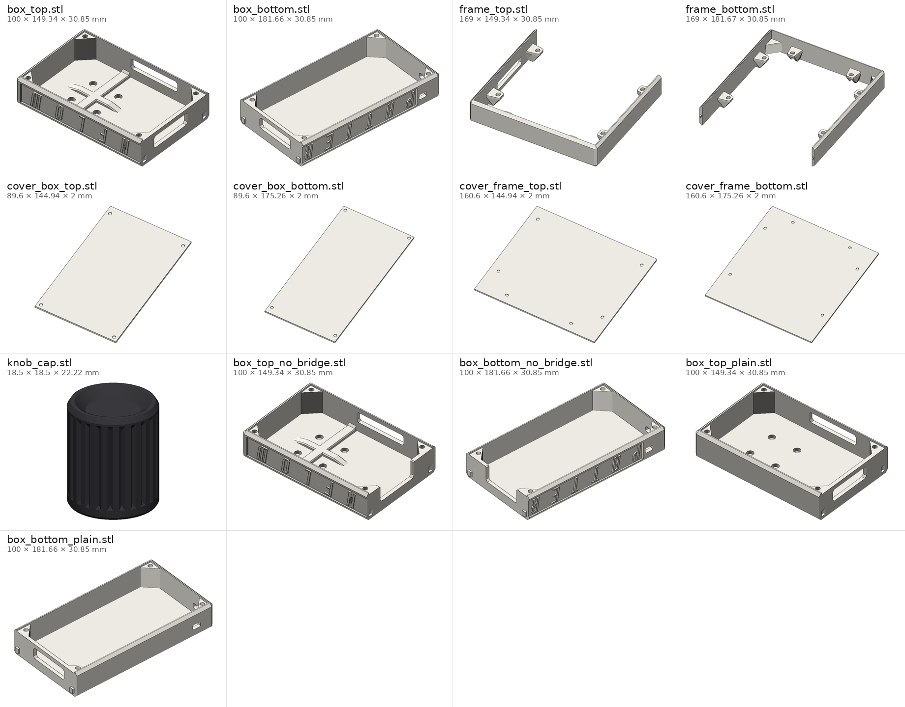

Sizes are as the part lies for printing (x × y × z, in mm). *Closed* means every edge of the mesh is shared by exactly two triangles. *In the 3MF as* is the name the part has in Besoiobiy's project.

| File | Part | Size (mm) | Closed | In the 3MF as | Print |
| :--- | :--- | :--- | :---: | :--- | :---: |
| [`box_top.stl`](stl/box_top.stl) | Box, top half: the four encoder holes, NFLOW lettering | 100 × 149.34 × 30.85 | yes | `test.stl` | 1 of the 3 top halves |
| [`box_top_no_bridge.stl`](stl/box_top_no_bridge.stl) | The same, without the bridge | 100 × 149.34 × 30.85 | yes | — | |
| [`box_top_plain.stl`](stl/box_top_plain.stl) | The same, without the lettering | 100 × 149.34 × 30.85 | yes | — | |
| [`box_bottom.stl`](stl/box_bottom.stl) | Box, bottom half: the battery bay, PATTER lettering, the openings for the power cable | 100 × 181.66 × 30.85 | yes | `BatteryTest.stl` | 1 of the 3 bottom halves |
| [`box_bottom_no_bridge.stl`](stl/box_bottom_no_bridge.stl) | The same, without the bridge | 100 × 181.66 × 30.85 | no, see below | — | |
| [`box_bottom_plain.stl`](stl/box_bottom_plain.stl) | The same, without the lettering | 100 × 181.66 × 30.85 | yes | — | |
| [`frame_top.stl`](stl/frame_top.stl) | Frame around the panel, top half, six panel tabs | 169 × 149.34 × 30.85 | yes | `Frame1.stl` | 1 |
| [`frame_bottom.stl`](stl/frame_bottom.stl) | Frame, bottom half, six panel tabs | 169 × 181.67 × 30.85 | yes | `Frame2.stl` | 1 |
| [`cover_frame_top.stl`](stl/cover_frame_top.stl) | Cover behind the panel, top | 160.6 × 144.94 × 2 | yes | `crishka.stl` | 1 |
| [`cover_frame_bottom.stl`](stl/cover_frame_bottom.stl) | Cover behind the panel, bottom | 160.6 × 175.26 × 2 | yes | `Plate2.stl` | 1 |
| [`cover_box_top.stl`](stl/cover_box_top.stl) | Cover for the box, top | 89.6 × 144.94 × 2 | yes | `Crishka4.stl` | 1 |
| [`cover_box_bottom.stl`](stl/cover_box_bottom.stl) | Cover for the box, bottom | 89.6 × 175.26 × 2 | yes | `Crishka3.stl` | 1 |
| [`knob_cap.stl`](stl/knob_cap.stl) | Knob, 18.5 mm across, for a 6 mm D-shaft (one with a flat, like the BOM's encoder) | 18.5 × 18.5 × 22.22 | yes | `Colpacec.stl` | 4 |

`box_bottom_no_bridge.stl` fails the strict test in one place: a 48.5 mm edge meets five shorter edges along the same line, at the foot of the end wall where it meets the front. Cutting the bridge away re-meshed that wall's inner face. There is no gap in the surface, and slicers close it on import.

Each file in `stl/` is one connected piece of `source/patternbox.stl`, unchanged except for its placement: turned the way the 3MF lays that part on the plate, set on the bed and centred. The scene STL holds 45 more pieces that are not parts, and they are not in `stl/`: six thin slivers inside the knob cap, 33 small cylinders and pegs the size of the insert holes, the encoder holes and the tab slots, three unsplit 329 mm bodies 24.4 mm deep that the notes do not mention, a 292 mm bar, a flat strip, and a stray pair of triangles 6 m across.

## Variants

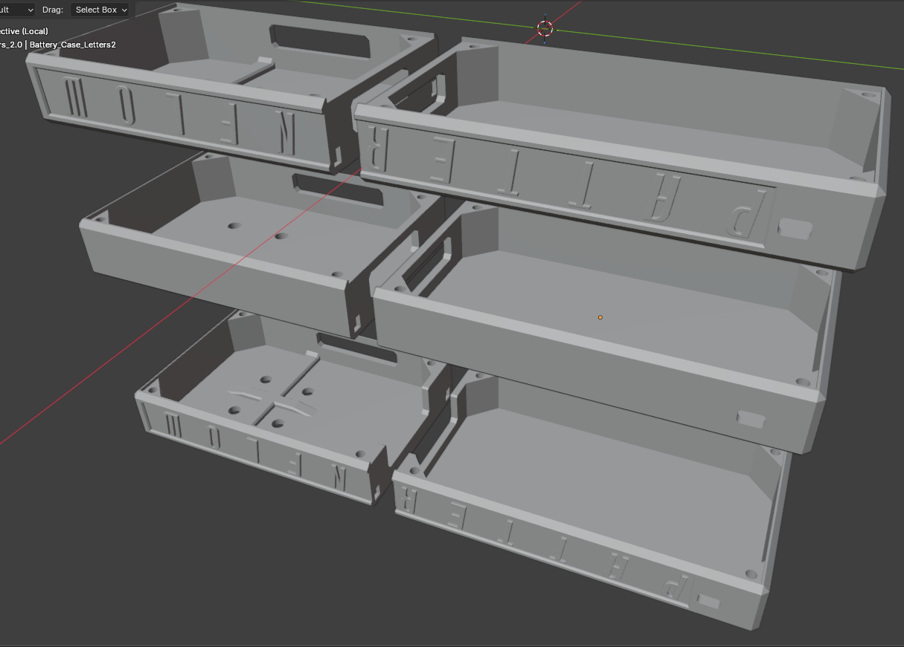

*Figure 3: the box halves, with and without the lettering and the bridge.*

Each box half comes three ways: print one top half and one bottom half. The 3MF has the first row; the halves in the photo carry the lettering.

| | Top half | Bottom half |
| :--- | :--- | :--- |
| Lettering, with the bridge | `box_top.stl` | `box_bottom.stl` |
| Lettering, no bridge | `box_top_no_bridge.stl` | `box_bottom_no_bridge.stl` |
| No lettering, with the bridge | `box_top_plain.stl` | `box_bottom_plain.stl` |

- **No bridge.** Where the two halves meet, each end wall has a long window. The bridge is the strip of wall between that window and the edge the cover sits on, about 48 × 5 mm. Without it the window opens onto that edge, which in Besoiobiy's words is for easier access to the USB. The DevKit's USB port carries data, for flashing and wired MIDI, and never power: see the [build guide, section 2](../../../../BUILD_GUIDE.md#2-power-input--use-the-screw-terminal).
- **No lettering.** The plain halves also lack the engraved lines on the front, and the plain top half has a flat inside face where the others have a cross-shaped rib between the encoder holes.

## Printing

Print each part the way the 3MF lays it, which uses the least material according to Besoiobiy; the files in `stl/` already lie that way. The box halves go front face down, the frame halves stand on their back edge, the covers lie flat with their counterbored face down, and the knob caps stand with the dished top up. Every part fits a 256 × 256 mm bed on its own.

### The 3MF

`print_layout.3mf` is a Bambu Studio 2.8 project for a P1S with a 0.4 mm nozzle on the textured PEI plate. Besoiobiy laid the parts out side by side so that it is clear which is which, and saved it like this:

- Only the knob cap is on the plate and set to print. The other eight parts are switched off and lie outside the plate: switch them back on in the object list and arrange them onto plates. Print the knob cap four times.
- 0.1 mm layers (the knob cap 0.2 mm, with ironing on its top), 3 walls, 20 % gyroid infill (the frame halves 25 %), and supports only where they are painted on (support type *normal (manual)*, style *snug*). Every part has painted supports, which an STL cannot carry: in another slicer, set supports yourself.
- The filaments are Bambu PLA Matte and PLA Basic, both set to black. The case in the photo is white.
- Only the halves with the lettering and the bridge are in it. For a variant, import its file from `stl/` in place of the half it replaces.

The box halves in the 3MF are not quite the ones in the STL. Their locating keys, the small tongues that go into pockets in the frame and in the other box half, are 0.2 mm larger on each side in the 3MF. Everything else matches: the frames and the covers exactly, and the knob cap in shape. The notes do not say which version was printed. If the keys go in hard (known issue 3), the STL halves give 0.2 mm more room on each side.

## Hardware

| Qty | Part | Where |
| :---: | :--- | :--- |
| 8 | M3 heat-set brass inserts, M3 × 8 × 5 (Besoiobiy's size) | The corners of both box halves, red in figure 6. The holes for them are 5.0 mm across and 9 mm deep. |
| 8 | M3 × 10 countersunk screws | Through the two box covers into the inserts, orange in figure 6. |
| 12 | M3 × 25 countersunk bolts | Through the two frame covers (green in figure 7) and the frame's tabs (turquoise) straight into the LED panel's threaded sockets. No inserts here: the cover, the frame and the panel are clamped together. [Check the reach first.](#check-your-panel-first) |
| 1 | USB power bank, 5 V | In the bottom half. The bay is 90 mm wide and about 24.8 mm deep, from the inside of the front to the cover. Its corners are chamfered, so a bank the full 90 mm wide can be about 143 mm long, a narrower one up to about 170 mm down the middle. |
| — | Glue | For the halves, in the order of figure 5. The notes do not name a glue. |

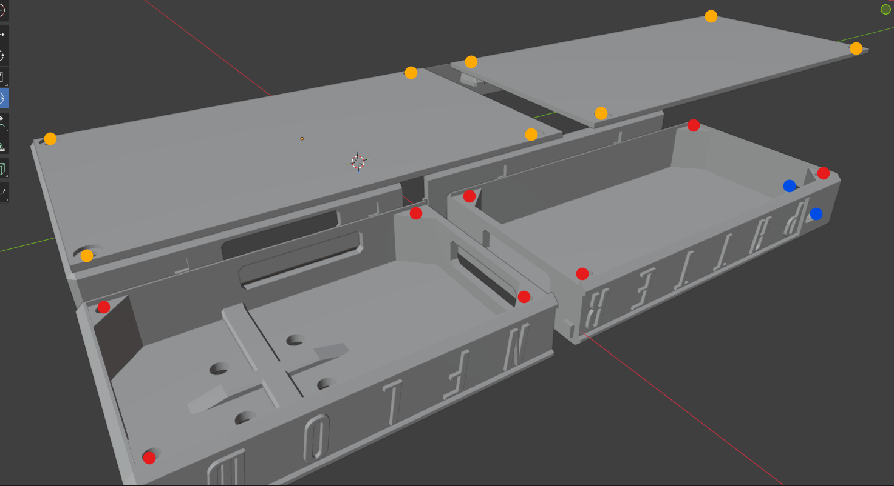 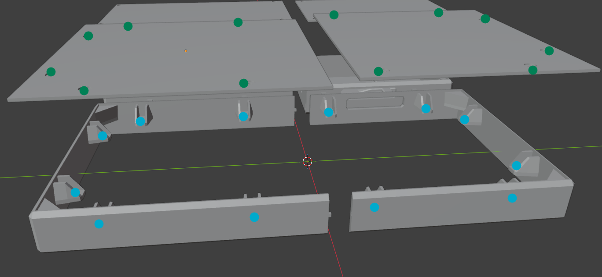

*Figure 6 (left): inserts in red, M3 × 10 in orange, the power-cable openings in blue. Figure 7 (right): the M3 × 25 bolts go in through the green holes and into the turquoise tabs.*

The two blue dots in figure 6 are the openings for the power cable, near the bottom end of the box: one in the lettered side wall, just below the P, and one in the end wall. Besoiobiy's notes say one is for vertical installation and the other for horizontal, without saying which is which. In the photo the case is held upright and the cable leaves through the side wall; standing on its bottom end, the case would sit on the end-wall opening, so that one is for the case lying the other way. Whatever the cable feeds, power reaches the board only through `J4`, the screw terminal.

## Assembly

The build guide's sections 5 (soldering), 7 (wiring), 8 (firmware) and 9 (checks) still apply, but in a different order: the frame covers close over the back of the panel, and the box covers take the place of the official snap-fit back panel.

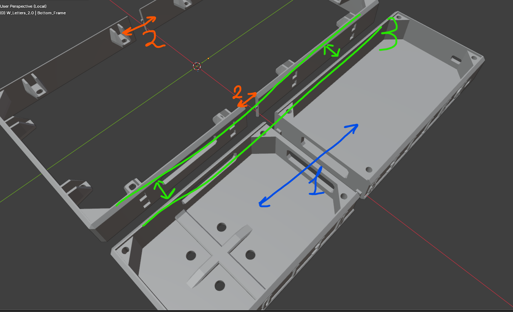

*Figure 5: the gluing order.*

1. **Glue the halves, in the order of figure 5:** first the two box halves end to end (1), then the two frame halves (2), then the frame to the box along its long side (3). The keys and pockets in each joint (figure 4) line the parts up.
2. **Set the eight inserts** into the corners of the box (red in figure 6), at any point before the box covers go on.
3. **Wire the panel before it is closed in.** Lower the ribbon's connector if it is too tall to fit (figure 8, below), plug the ribbon into the panel's `HUB-75E IN` and the power lead into the panel, and pass both through the window in the frame's side wall into the top half of the box. Their other ends go to `J1` and `J3` later (build guide, section 7, steps 1 and 2).
4. **Panel.** Put the panel into the frame from the front, its sockets against the tabs; the build guide puts `HUB-75E IN` toward the top. Lay the two frame covers over it from behind and drive the twelve M3 × 25 bolts through the covers and the tabs into the panel's sockets (figure 7). From here on the back of the panel is closed.
5. **Power cable.** Clamp the power cable into `J4` before the board goes in (build guide, section 7, step 3). If it is to leave the case, thread it through one of the two openings first (see [Hardware](#hardware)).
6. **Board.** The encoders come through the four holes in the front of the top half; fasten their nuts from the front, as in [section 6 of the build guide](../../../../BUILD_GUIDE.md#6-case-assembly). Connect the ribbon to `J1` and the panel's power lead to `J3`, and seat the DevKit (section 7).
7. **Power bank, firmware, checks.** Put the power bank in the bottom half and connect it to the `J4` cable, flash the firmware (section 8), and run the checks in section 9, steps 1 to 6, with the box still open.
8. **Close the box** with the two box covers and the eight M3 × 10 screws (orange in figure 6). This replaces closing the back panel in section 9, step 7.
9. **Knobs.** Put the four knob caps on the encoder shafts last.

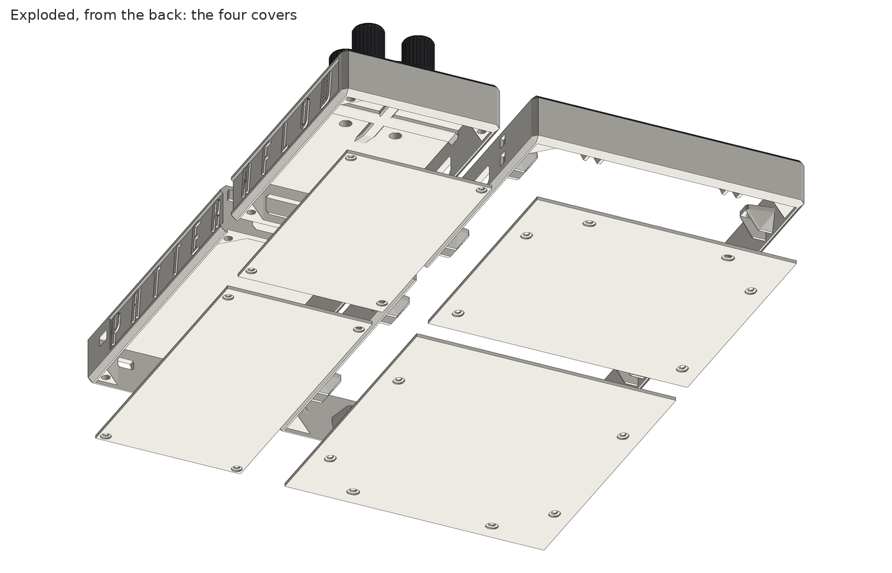

*The four covers from behind, rendered from the STL files: once the frame covers are on, the back of the panel is closed.*

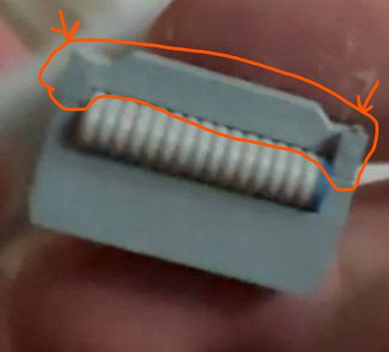

*Figure 8: the clip over the ribbon connector, outlined in orange.*

The ribbon cable from the panel takes a lot of height. The clip over the top of its connector, outlined in orange in figure 8, can be unfastened carefully, and the cable then stands half as tall. Besoiobiy's clip was locked too firmly, so they cut its two plastic legs with wire cutters; the cable still works.

## Check your panel first

The case was drawn around Besoiobiy's panel, and panels differ.

- **Thread size.** Besoiobiy's panel takes M3 bolts, and the holes in the frame covers pass nothing larger. The panel the build guide links is mounted with M4 screws (build guide, section 1); with that panel, the cover holes would have to be opened up.
- **Socket depth.** Besoiobiy's panel has a socket depth of 14.35 mm (1.435 cm in their notes). In the files, the fronts of the frame's tabs, where the panel's sockets rest, are exactly 14.35 mm behind the frame's front edge, so the figure is the distance from the LED face to the ends of the sockets, and with that panel the face lies flush with the front of the frame. Measure yours the same way. If it differs, the face stands out from the frame or sits back in it by the difference.
- **Bolt reach.** With the cover in place, flush with the back of the frame, an M3 × 25 bolt ends about 8.5 mm past the front of the tab, inside the panel's socket. Check that your panel's threaded holes are at least that deep and closed at the bottom; if they are not, use a shorter bolt.
- **Bolt positions.** The twelve bolts, measured from the centre of the frame's opening: eight at ±69.5 mm across and ±32 mm and ±123 mm along, and four at ±43 mm across and ±149.5 mm along. The tabs have 5 × 6 mm slots, but the holes in the covers are 3.2 × 4.2 mm slots. An M3 has about half a millimetre of play along each of them and only about 0.1 mm across: across the panel for the eight side bolts, and along it for the four end bolts. So in those directions your panel's sockets have to sit where these are. A frame cover is a 2 mm plate and a short print: print one first and lay it on the back of your panel.
- **Outline.** The opening in the frame is 161 × 321 mm, for a 160 × 320 mm panel.

Whether a panel lights up at all is a separate question: read [LED panel compatibility](../../../../docs/panel-compatibility.md) before buying one.

## Known issues and open improvements

Besoiobiy listed three, and shared the files so that someone else could take them further. A fix is welcome as a pull request on this folder.

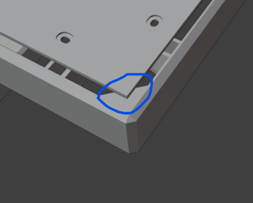 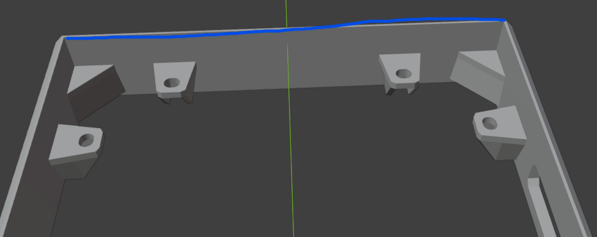

*Figure 1 (left) and figure 2 (right).*

1. **The corners bulge (figure 1).** With all the screws tight, the corners circled in blue bulge out slightly.
2. **A gap between the panel and the frame (figure 2).** Along the blue line there is a small gap between the panel and the frame. The opening is half a millimetre larger than the panel on every side. Closing it would look better; leaving it makes room for other panels.
3. **Tight keys (figure 4).** The keys sometimes went into their grooves only with difficulty and had to be sanded. Besoiobiy suspects the grooves themselves or the print settings, and has heard that Bambu Studio can make such joints itself, but has not tried it. The STL halves give 0.2 mm more room on each side than the 3MF ones (see [The 3MF](#the-3mf)).

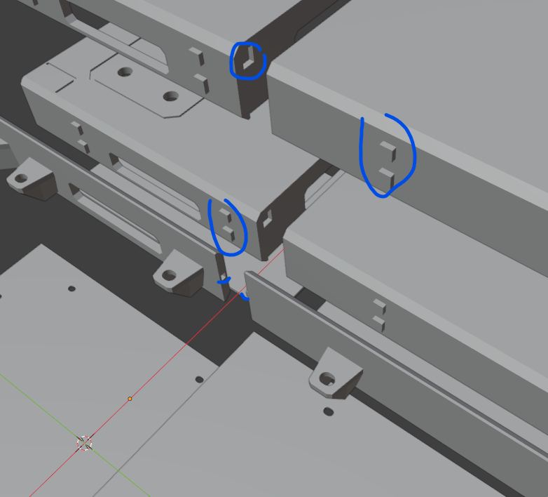

*Figure 4: the keys and grooves, circled in blue.*

## Measured from the files

A check of the files against the board's KiCad files, made when the folder was added. It is a measurement, not a second build.

- The encoder holes are 7.2 mm across, 30.8 × 30.1 mm apart. The encoders on the v3 board are 31 × 30.5 mm apart, so the fit relies on the play in the holes and in the encoders. Besoiobiy's build works.
- Assembled, the frame is 169 × 329 mm and the box 100 × 329 mm, joined over 2 mm keys: about 267 × 329 × 30.85 mm in all.
- The covers' holes are not countersunk but counterbored, 1 mm deep with a flat bottom: 3.5 mm holes in 6.2 mm counterbores in the box covers, 3.2 × 4.2 mm slots in 6.25 × 7.5 mm counterbores in the frame covers. A countersunk head sits a few tenths of a millimetre proud of them. The frame's tabs are 3 mm thick, and each cover rests on a ledge flush with the back of the case.
- The power-cable openings are 6.2 × 10 mm.
- The knob cap's bore is a D: 6.3 mm round with a flat, 5.1 mm across the flat, about 9.8 mm deep, above a recess 12 mm across and 2 mm deep in its underside.

## Besoiobiy's notes

The message that came with the files, word for word (Patternflow Discord, 2026-10-08)

The figures arrived as `image.png` and `1.png` to `8.png`. Figure 1 is `image.png`, figure N is the file numbered N − 1, and `8.png` is the photo. In this folder they are `images/fig1_…` to `images/fig8_…` and `images/photo_built.jpg`.

> Hi &#64;Seunghun Lee !
>
> I promised to share the source files for the case after I've finished working on it. I've fully assembled the patternflow, and it's been working for a week now and looks great. Unfortunately, I don't have the strength or the desire to make minor adjustments to the case, let alone spend materials on assembling new prototypes, so I'm sharing the source files in .blend and .stl with you so that you can either simply use them (by posting them on your website) or make additional improvements.
>
> Known issues:
>
> 1\) 1st picture What I circled in blue is a problem because when all the screws are tightened, these corners will bulge out slightly.
>
> 2\) 2nd picture When installing the LED panel, this long blue line represents a small gap between the panel and the frame. I'm not sure how much of a problem this is, but if you want to make it perfect, you can eliminate the gap; on the other hand, this makes it easier to install different models of LED panels.
>
> 3\) 4th drawing, I highlighted all the grooves that the structure has, probably I didn't get very good grooves, or the printing settings were not high enough, so sometimes they entered with difficulty and I had to grind them a little with sandpaper. I've heard that grooves can be made directly in bambu studio, but unfortunately I've never worked with it and I don't know how much better they are.
>
> P.S. I hope I haven't forgotten anything)
>
> Also, this scene includes versions of the case without the internal bridge (for easier access to the USB), and a model of the case without the label. (shown in Figure 3)
>
> I indicated the order of gluing the parts in Figure 5.
>
> In Figure 6, I indicated with red dots where the hot brass thread of dimensions M3x8x5 needs to be installed, and with orange dots I indicated which holes for fastening need to be used to screw in bolts with a hidden head of size M3x10. With blue dots on the same figure, I indicated the terminal for the power cable (one side for vertical installation, the other for horizontal).
>
> In Figure 7, I indicated with turquoise dots where the M3x25 bolts with a hidden head should be screwed in; they go in through the green dots. There is no hot brass thread here; instead, the bolts are screwed directly into the LED panel, forming a clamped sandwich.
>
> In Figure 8, I indicated the cable from the LED panel, it takes up a lot of space in height, but this can be fixed if you carefully unfasten what I highlighted in orange, mine turned out to have a too strong lock, so I just bit its plastic legs with wire cutters, and thus the cable became 2 times lower but still working.
>
> I also changed the caps for the twirlers, but it makes no sense to show it, you'll see for yourself)
>
> My LED panel socket has a depth of 1.435 cm, this must be taken into account because, as we have seen, they have different thicknesses.
>
> The 3mf file for bambulab, I put everything side by side so that it would be clear what was what, you need to print exactly in such orientations as they are for less waste of plastic.
>
> And of course, the last photo for demonstration

