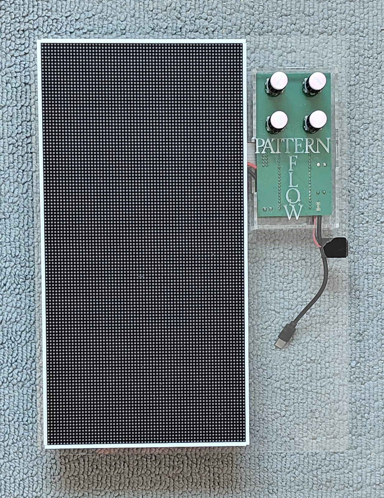
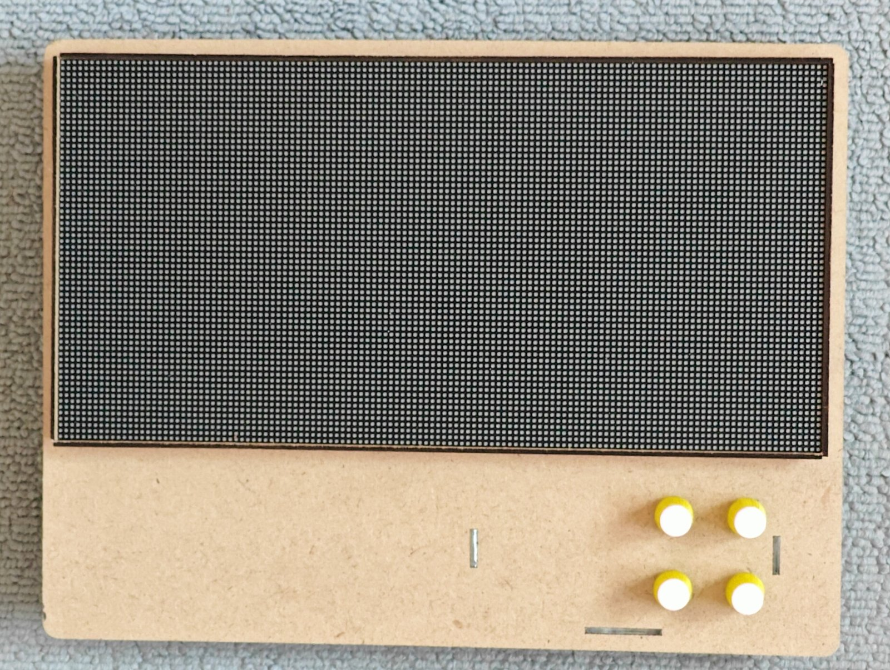
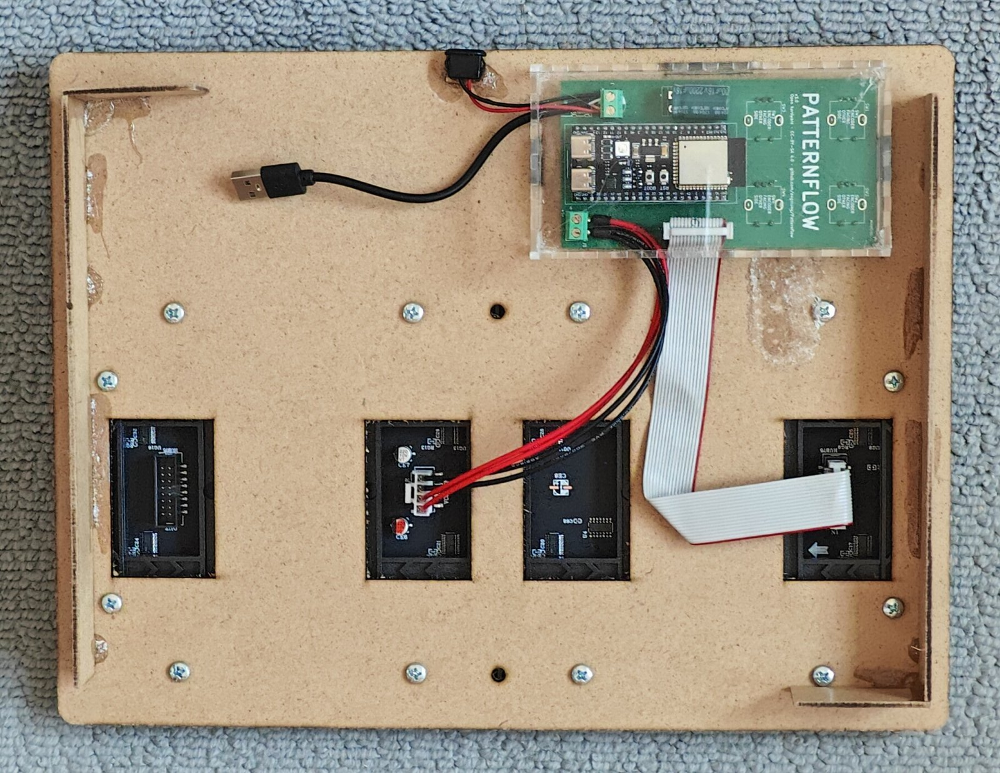
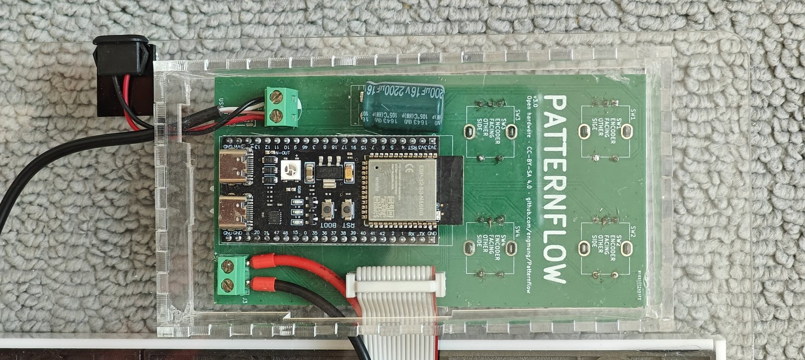

Author: Simone Majocchi (SimonePDA), https://github.com/SimonePDA  
Based on: original design  
Fits: v3 board (built on v3.0; v3.9 has the same outline) and a 320 × 160 mm LED panel  
Material: 3 mm acrylic (about 2.75 mm with the film off) or 2.8 mm MDF, laser cut  
Verified: 2026-10-05, photos below. Cut three times by its author, in acrylic and in MDF

# Laser-cut case

A Patternflow whose whole body is cut from sheet. One flat piece, 256 × 340 mm, carries everything: the LED panel is screwed to it from behind, into the panel's own threaded inserts, with four strips around the panel to protect the LEDs at its edge. The board sits beside the panel on the back of the sheet, under a small finger-jointed box, and its four encoder shafts come through to the front. Stood upright, the knobs are to the right of the panel; turned on its side, they are below it. Three open cubes are feet for laying it flat on a table.

 

*Left: clear acrylic, upright. Right: the same drawing in MDF, on its side.*

 

*Left: the MDF one from behind. The panel is screwed on through the sheet, its connectors show through the four windows, and the board is under its box. Right: the board in its box, on the acrylic one.*

This folder replaces the printing and case-assembly sections of the [build guide](../../../../BUILD_GUIDE.md) (4 and 6). The electronics, the soldering, the wiring and the firmware are the same. Knobs are not in the drawing: print the ones in [`knobs/`](../../knobs/), or fit any that suit your encoders' shafts.

## Files

| File | What |
| :--- | :--- |
| [`lasercut_layout.pdf`](lasercut_layout.pdf) | The drawing: six A3 pages at 1:1. Pages 1, 3 and 5 are the ones to cut; 2 and 4 show how the parts sit together; 6 is a panel maker's dimension drawing, there for reference. |
| [`lasercut_layout.cdr`](lasercut_layout.cdr) | The CorelDRAW 2019 source. |

The sheet has to fit your cutter's bed whole: 256 × 340 mm. That number is also the check that an import kept its scale.

The two sections below are Simone's own notes on the drawing.

## The pages

**Page 1** contains the very useful borders for the LED panel: failing to protect the panel's border can chip away some LEDs. It is designed to flush on one side and have the abundance on the other side so that it closes perfectly. Some LED panels do have a slight taper so one side needs filing to fit properly. These four pieces fit both 128x64 AND 64x64 double panels.

**Page 2** allows you to check if your panel has the same holes and has some construction boxes left in place to let you see exactly how it was done. The PCB is shown as a rectangular box and shows how the acrylic box is designed to leave some space around it.

**Page 3** is the clean cutting of the acrylic sheet or MDF panel. I am assuming the standard Acrylic thickness of roughly 2.75 mm (with or without protection changes by +/- 0.2mm). Please check your panel's exact hole positioning before cutting! Their axis will be the same, but position might change. This is particularly true if you go for 64x64 panels.

**Page 4** again shows the box protecting the PCB in place, to confirm the three slots that will hold it in place.

**Page 5** is for the protective box with the slot to let the power and flat cable towards the panel and the design for the open cubes to use as feet to keep the panel resting properly on a surface. You need to make three cubes to keep the panel balanced when flat on a table.

**Page 6** is the layout of ONE of the MANY 128x64 panels for reference.

## Notes (do not skip!)

- The design is tested and was cut 3 times on Acrylic and MDF.
- The panel has on the perimeter some "alignment pins" that will create troubles in making the panel FLAT on the surface. Before you start fixing the panel look for these pins and cut them, filing away any residual plastic that is still above the rest of the panel border.
- The screws that fix the panel MAY be M4, but I found some M3 inserts, therefore check what you need. It is VERY IMPORTANT that the screw is 10mm or 12mm MAX because the inserts may be pass through and a longer screw might hit the PCB and damage it (it happened to me).
- The box protecting the PCB is held in place by the three slots and keys on the perimeter. Depending on the material used they could have a snug or a loose fit. I suggest that you use some tape on the keys to make them thicker and stay in place. The whole design of the box should not force in any way the assembly if you use the 2.75mm (before peeling mine is 3mm) or MDF that is usually 2.8mm everything should work. Anyways "measure twice, cut once". Most probably you will have a loose fit with the slots on the sides of the box and therefore some glue is needed. Feel free to redesign the box with the exact thicknesses using mine as a starting point (https://www.makercase.com/).

## Measured against the board

A check of the drawing against the board's KiCad files, made when the folder was added. It is a measurement, not a second build.

- The PDF is to scale: the sheet is 256 × 340 mm, the panel outline 160 × 320 mm, and the board drawn on pages 2 and 4 is 62 × 116 mm. The v3 board is 62 × 116.25 mm.
- The slots that hold the box are 2.7 mm wide, and the holes for the panel's screws are 5 mm.
- The four knob holes are 8 mm, on a 30 × 30 mm grid. The encoders on the v3 board are 31 × 30.5 mm apart, so the fit relies on those holes being oversized. The builds in the photos went together as drawn.
